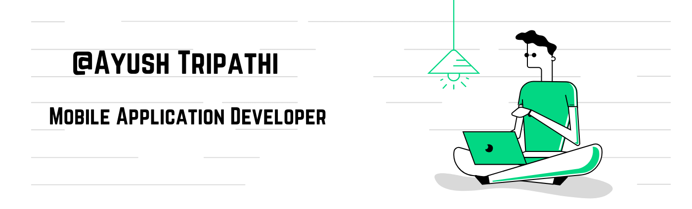

<h1> Hey! What's up...</h1>

### Mobile Development Enthusiasts | Flutter | ReactNative | AWS Nerd 

<!-- **uannabi/uannabi** is a ✨ _special_ ✨ repository because its `README.md` (this file) appears on your GitHub profile. -->

I want to make difference and willing to work hard for skillful career rather than regular career that I can be satisfied for. I want to work hard, be responsible and improve my profession and skills with a reputed organization in an ethical way in order to accept challengess.
 
 

- 🔭 I’m a Co-Founder at [MBK - Health Tech](https://www.mbk-health.com)
- 👨‍💻 I'm also working on Saas Platform for my startup company.
- 🌱 I’m currently gathering knowledge & experience on React Native.
- 👯 I’m looking to collaborate for Hackathon.
- 🤔 I’m looking for help with Backend stuff.
- 💬 Ask me about Flutter & Firebase.
- 📝 You can check my Resume for more details about work experience.

## Experienced with 

<code>  </code>

<strong>🔭 you can start from here ...</strong>

 
 

<!-- - 😄 Pronouns: ...
- ⚡ Fun fact: ... -->

:zap: Github Stats

<a href="#"><!-- wi*quL3fcV --></a>
